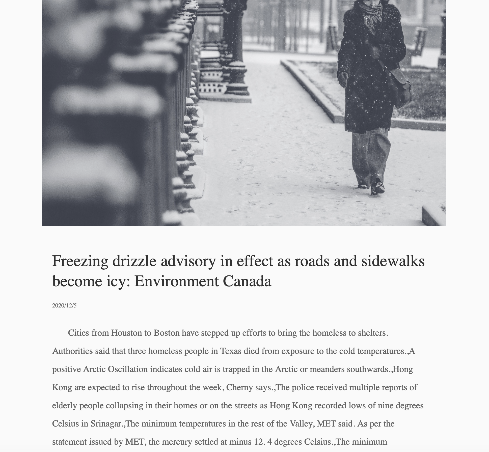

# The Weather News
By Mengxuan ZHAO
 2021/05
 

***The Weather News*** is a programming artwork using voice detection to catch the keywords about weather in views’ speech, then generate a random piece of weather news related to the keyword.

 
 

## Introduction to the work

When Viewing the artwork, the viewers are expected to talk about what the weather is like in their place. When an answer is given, the program will catch the *weather word* and recognize it with a machine learning model, then generate a piece of made-up news about a kind of extreme weather related to the keyword with RiTa markov.

**View the video demonstration of the artwork** ***[The Weather News](https://mx-zhao.github.io/weathernews/)***

 

## Inspiration

Climate change over the past 50 years has been easy to be ignored, since these changes are difficult to see year over year. Especially in areas that have yet to experience the serious influences. However, there are signs showing that the earth is going through a series of changes, for example, extreme weather is increasingly difficult to refute.

We all live in the same world and are linked to each other in many ways including sharing the same piece of land and resources. We may meet with different kinds of weather in different places, which in most of the time is common to see. However,  there are also some people in other parts of the world facing severe situation brought by extreme weathers. The piece works as a medium to bridge people with different places and time, and to show the viewers a possibility of what might be going on in another place of the world.

 

## Technical

#### *Voice input*

The voice detection function is trained with Teachable Machine, a machine learning model provided by Google Creative Lab.

The trained model can recognize 13 keywords related to weather, including: Sunny, cloudy, overcast, rainy, stormy, snowy, fog, thunder, drizzle, sandstorm, hurricane tornado and typhoon.

The model is expected to be trained with as many samples as possible, however, in this work, it is trained with voices of me and two of my friends, each one repeating the keywords for hundreds of times in different tones.

Furthermore, the detection may be affected by the background noise. Please be sure to open up the site at somewhere quiet for the best detection effect.

#### *News generation*

The news piece is generated from existing news pieces about severe weathers from Times News, which is fetched with Times News API and pre-stored in the files. When recognizing a weather word, the program reads through 30-35 pieces of the most recent news and use RiTa markov function to generate a paragraph with 20-25 lines.

The content of the source news is related to the input words. For example, when given the word “sunny”, the program would read through news related to drought, and when given the word “rainy”, news about flood and standing water. Each time new source texts are added on to the previous one, while the header image is changed according to the topic.

 

## About the artist

Mengxuan ZHAO
Year 4 student of City University of Hong Kong, School of Creative Media. Major in New Media and minor in Asian and International Studies.
 The Weather News is my very last artwork at SCM. From now on I'll be taking art creation as a career and I'm hoping to polish my skills and learn more through my further experiences. Wish to see you in my next work!

 

## 

*Special thanks to professor Daniel Howe for instructions during the past semester
 to Joyce and Alyssa for the training of voice detection
 as well as my friends and classmates who kindly offered their suggestions.*
